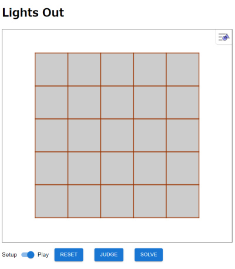
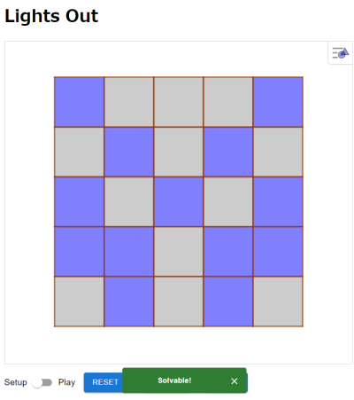
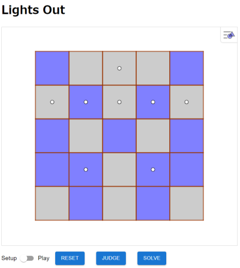

# Lights Out Puzzle App with GeoGebra and WebAssembly
This is the repository for a web app of the mathematical puzzle 'Lights Out'. It uses react-geogebra/React for the UI and C language/WebAssembly for the computational engine.

## How to build this app
```bash
git clone https://github.com/mitsushi-fujimoto/geo-lights
cd geo-lights
npm install --legacy-peer-deps react-geogebra
npm install @mui/material @emotion/react @emotion/styled
npm run build
```
## How to run this app
The app will be launched when you access the build directory from a web browser. 
However, you need to start a web server before running the app.
```bash
python3 -m http.server &
```
Then, access http://localhost:8000/build/ from a web browser.
## How to use this app
The app built by the above process is available at [geo-lights](https://mitsushi-fujimoto.github.io/geo-lights/).
1. Change the mode to 'Setup', then create a pattern. In 'Setup' mode, only the clicked cell will be inverted.
2. Click the Judge button to determine solvability. The result will be displayed in a snackbar.
3. Change the mode to 'Play', then solve the puzzle.
4. If you want to know the solution, click the Solve button. White circles will be displayed on the cells that should be clicked.
## Screenshots
<p align="center">
  
  
  
</p>
